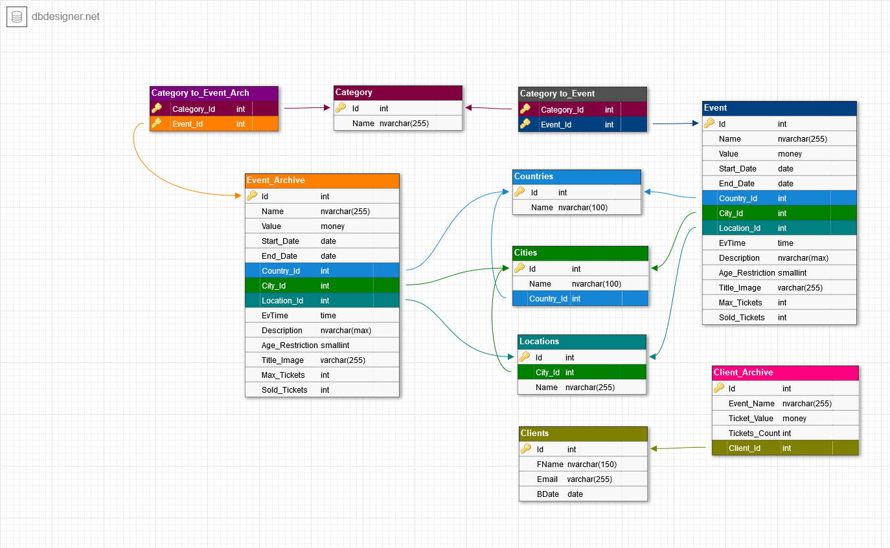

# SQL_exam_2
 ### ***EventsDB Morozov M.E. с9п1_32***

<dev >
</dev>

 DB Technical task  

---

Для веб-проекта «Афиша событий» необходимо создать базу данных. В базе данных нужно хранить такую информацию:
 
- Категории событий 
    - спектакль 
    - концерт 
    - выставка 
    - цирк 
    - спорт 
    - семинары и тренинги 
    - кино 
    - юмор 
    - вечеринки 
    - детям 
    - другое 
    
- Событие 
    - название события 
    - дата проведения или диапазон дат 
    - страна проведения 
    - город проведения 
    - место проведения 
    - время проведения 
    - категория события 
    - описание события 
    - возрастные ограничения  
    - изображение для афиши события
    - максимальное количество билетов  
    - количество приобретенных билетов 
 
 - Клиенты  
    - ФИО клиента  
    - контактный email клиента  
    - дата рождения  
    - приобретенные клиентом билеты 
        - название события 
        - цена билета

- Архив событий.

> При проектировании базы данных обязательно используйте индексы. За отсутствие индексов или неправильное использование экзаменационная оценка может быть уменьшена. Продумайте систему безопасности.
- Обязательные требования к ней:
    - Пользователь с полным доступом ко всей информации 
    - Пользователь с правом только на чтение данных 
    - Пользователь с правом резервного копирования и восстановления данных 
    - Пользователь с правом создания и удаления пользователей. 

- С помощью представлений, хранимых процедур, пользовательских функций, триггеров реализуйте следующую функциональность: 
    - Отобразите все актуальные события на конкретную дату. Дата указывается в качестве параметра
    - Отобразите все актуальные события из конкретной категории. Категория указывается в качестве параметра 
    - Отобразите все актуальные события со стопроцентной продажей билетов 
    - Отобразите топ-3 самых популярных актуальных событий (по количеству приобретенных билетов) 
    - Отобразите топ-3 самых популярных категорий событий (по количеству всех приобретенных билетов). Архив событий учитывается 
    - Отобразите самое популярное событие в конкретном городе. Город указывается в качестве параметра 
    - Покажите информацию о самом активном клиенте (по количеству купленных билетов) 
    - Покажите информацию о самой непопулярной категории (по количеству событий). Архив событий учитывается. 
    - Отобразите топ-3 набирающих популярность событий (по количеству проданных билетов за 5 дней)   
    - Покажите все события, которые пройдут сегодня в указанное время. Время передаётся в качестве параметра  
    - Покажите название городов, в которых сегодня пройдут события  
    - При вставке нового клиента нужно проверять, нет ли его уже в базе данных. Если такой клиент есть, генерировать ошибку с описанием возникшей проблемы 
    - При вставке нового события нужно проверять, нет ли его уже в базе данных. Если такое событие есть, генерировать ошибку с описанием возникшей проблемы
    - При удалении прошедших событий необходимо их переносить в архив событий 
    - При попытке покупки билета проверять не достигнуто ли уже максимальное количество билетов. Если максимальное количество достигнуто, генерировать ошибку с информацией о возникшей проблеме 
    - При попытке покупки билета проверять возрастные ограничения. Если возрастное ограничение нарушено, генерировать ошибку с информацией о возникшей проблеме 
    - Настроить создание резервных копий с периодичностью раз в день.

---

 DB scheme  

---

---

